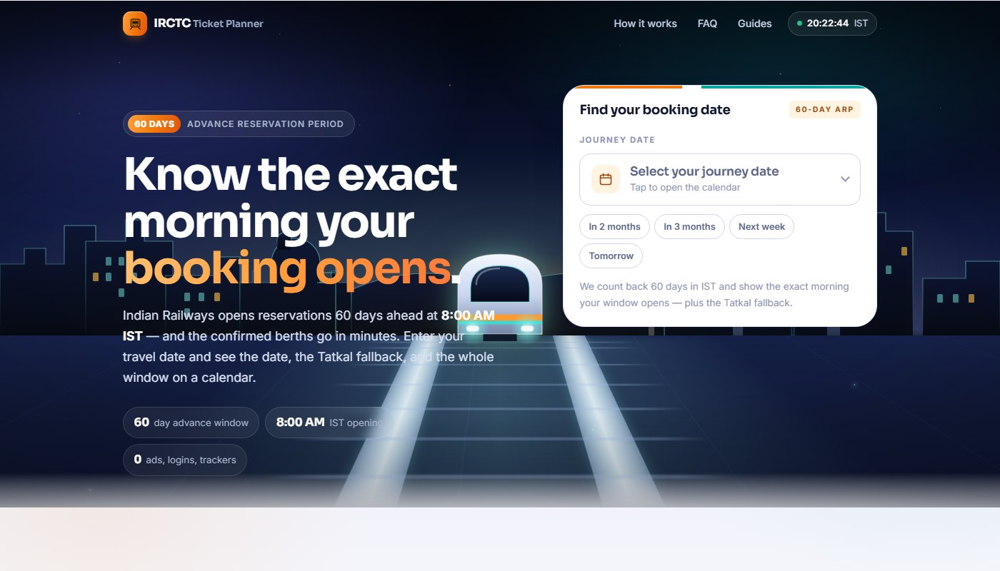
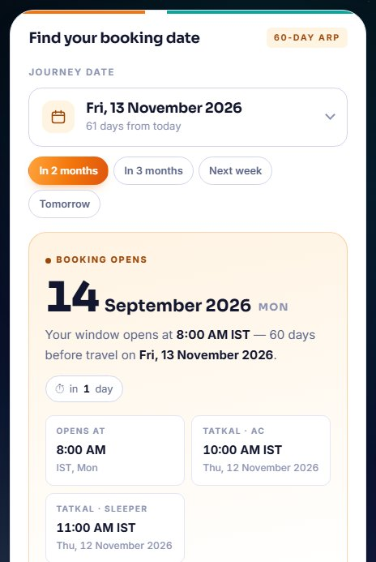
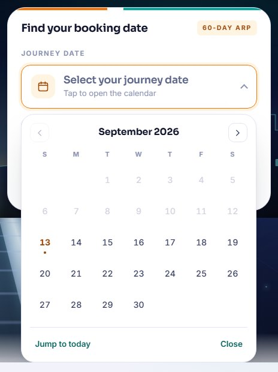
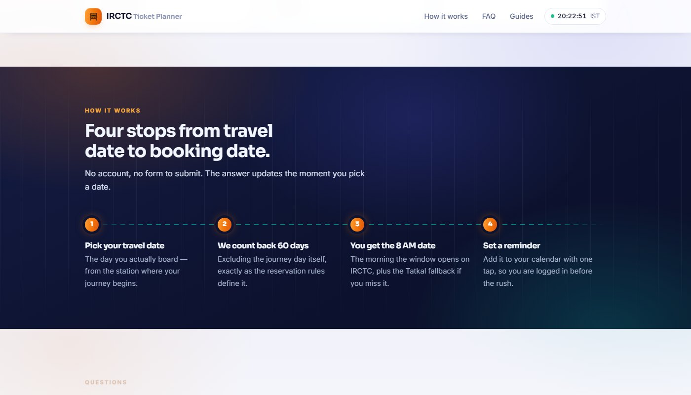
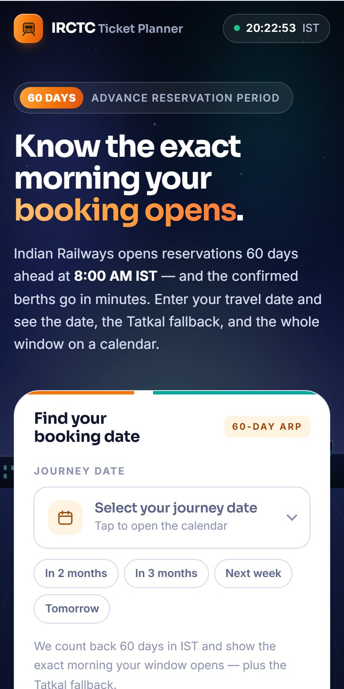

<div align="center">

# 🚆 IRCTC Ticket Planner

### Know the exact morning your Indian Railways booking window opens.

Indian Railways opens reserved bookings **60 days before your journey, at 8:00 AM IST** —
and the confirmed berths are gone in minutes. Miscounting that date is the most
common reason people miss a confirmed seat.

This tells you the date. No ads, no account, no tracking.

<br />



<br />

[](https://nextjs.org)
[](https://www.typescriptlang.org)
[](#testing)
[](#no-ui-dependencies)
[](LICENSE)

</div>

---

## What it does

Pick your travel date. You immediately get:

| | |
| --- | --- |
| 🗓️ **The booking-open date** | The exact day the 60-day advance window opens, and the 8:00 AM IST moment it starts. |
| ⏱️ **A countdown** | "In 47 days", so you know whether to plan or to act now. |
| 🎟️ **The Tatkal fallback** | 10:00 AM IST for AC, 11:00 AM IST for Sleeper, on the correct date. |
| 📅 **The whole window on a calendar** | Every month from opening day to travel day, with the window shaded. |
| 🔔 **A reminder** | One tap to a prefilled **Google Calendar** event, or an `.ics` file for Apple Calendar and Outlook. |
| 📋 **A copyable plan** | Plain text you can paste into WhatsApp for whoever is travelling with you. |

It also answers the three states people actually arrive in — *the window hasn't
opened yet*, *it's already open, book now*, and *too late, use Tatkal* — instead
of only the first one.

<table>
<tr>
<td width="50%"></td>
<td width="50%"></td>
</tr>
</table>

---

## The rule it implements

> Advance reservations open **60 days before the journey date, excluding the day
> of travel**, at **8:00 AM IST**, counted from the train's **source station**.

Two details that trip up most calculators:

1. **It is counted from the source station, not your boarding station.** If you
   board mid-route on a long-distance train, the train may have left its origin
   a day or two earlier — so your booking can open **1–2 days before** a naive
   count suggests. The app says this on every result rather than pretending to a
   precision it doesn't have.
2. **Everything is Indian Standard Time.** A visitor in New Jersey and one in
   Nagpur must see the same date. All arithmetic is anchored to IST (UTC+05:30)
   and performed on UTC-midnight calendar dates, so the device's timezone never
   leaks into the answer. There's a live IST clock in the header for the same
   reason.

The whole rule lives in one pure, dependency-free module —
[`lib/booking-dates.ts`](lib/booking-dates.ts) — and the UI is a thin layer over
it.

---

## Design

The landing page is built to earn a second of attention before it asks for a
date, using the modernisation of Indian Railways as its subject: a night
approach down an electrified track toward a lit city.



**The hero is real 3D, with zero JavaScript.** A CSS `perspective` viewport with
the ground plane laid down by `rotateX(76deg)`. The rails are drawn as *parallel*
lines on that plane, so perspective converges them at the horizon on its own, and
scrolling the sleepers toward the viewer reads as forward motion. No canvas, no
WebGL, no library, and it paints on the first frame — which matters more than the
effect does.

A few principles the rest of the page follows:

- **Atmosphere in the background, clarity in the foreground.** The planner panel
  is deliberately flat — no tilt, no perspective, no glass. It's the thing you
  aim a finger at, so it stays perfectly still on bright paper.
- **Nothing important depends on JavaScript.** Scroll reveals use CSS
  `animation-timeline: view()`, so a browser that doesn't support it simply shows
  the content. The header's default state is the readable one. A failed
  hydration costs you an animation, never a paragraph.
- **Motion is optional.** Every animation is disabled under
  `prefers-reduced-motion: reduce`.

Most of the traffic for a question like this arrives on a phone, so the phone
layout is the one that gets the compromises: the hero drops its stat badges to
lift the date picker above the fold, and the picker fills the panel width rather
than deferring to a cramped native control.

<div align="center">
  
</div>

---

## Accessibility

- The date picker is a full **WAI-ARIA grid** — `role="grid"` / `row` /
  `gridcell` with a roving tabindex. Arrow keys move a day, `PageUp`/`PageDown` a
  month, `Home`/`End` the week, `Enter` selects, `Escape` closes and returns
  focus to the trigger.
- The reminder menu is arrow-navigable and focus-restoring.
- Out-of-range days are genuinely `disabled`, not just greyed.
- Results are announced via `role="status"`.
- Colour is never the only signal: every calendar state carries a label in the
  legend, and every status carries text.

---

## Tech

| | |
| --- | --- |
| **Framework** | Next.js 14 (App Router), fully static — every route prerendered at build time |
| **Language** | TypeScript, strict |
| **Styling** | One hand-written stylesheet using `@layer`, custom properties and `color-mix()` |
| **Fonts** | Sora + Inter, self-hosted at build time via `next/font` |
| **Tests** | Vitest + Testing Library |
| **Analytics** | Vercel Web Analytics (cookieless) |

### No UI dependencies

There is no UI framework, component library, CSS framework, animation library,
date library or 3D library in this project. The date maths, the calendar, the
date picker, the `.ics` builder and the 3D scene are all first-party. Total
first-load JavaScript is **~94 kB**, most of which is React itself.

This isn't minimalism for its own sake — the product's entire promise is that it
loads fast on a weak signal and tells you one thing.

---

## Project structure

```
app/
  layout.tsx              Shell, metadata, JSON-LD, fonts, header/footer
  page.tsx                Home: hero, features, how-it-works band, FAQ, guides
  globals.css             The whole design system and the 3D scene
  guides/                 Three SEO guide pages
  sitemap.ts robots.ts    Generated at build time
components/
  Calculator.tsx          The planner panel (the only stateful surface)
  DatePicker.tsx          Custom accessible calendar control
  ResultCard.tsx          The answer, the reminder menu, the actions
  CalendarView.tsx        Month grids with the booking window shaded
  RailScene.tsx           The 3D hero scene (static, server-rendered)
  ISTClock.tsx            Live IST clock
  Enhancements.tsx        Pointer parallax + header state (purely additive)
lib/
  booking-dates.ts        ← the correctness core. Pure, IST-anchored, tested.
  calendar.ts             Google Calendar URL + .ics builder
  site.ts                 Site name, description, canonical URL
docs/                     README screenshots
```

---

## Getting started

```bash
npm install
npm run dev        # http://localhost:3000
```

```bash
npm run build      # production build
npm start          # serve the build
npm run lint       # ESLint (next/core-web-vitals + jsx-a11y)
```

### Testing

```bash
npm test           # run once
npm run test:watch # watch mode
```

32 tests cover the parts where a silent error would send someone to IRCTC on the
wrong morning: the IST-anchored date arithmetic, the four journey
classifications, the calendar's month spanning, and the IST→UTC conversion in
both the Google Calendar link and the `.ics` file.

---

## Deploy

Deployed on Vercel; the framework is auto-detected and no `vercel.json` is
needed.

1. Import the repository into Vercel.
2. Add your domain under **Project → Settings → Domains** and point its `CNAME`
   at Vercel.
3. Set `SITE_URL` in [`lib/site.ts`](lib/site.ts) to that domain — it feeds the
   canonical tag, the sitemap and the Open Graph metadata.
4. Optionally paste a Google Search Console token into
   `GOOGLE_SITE_VERIFICATION` in the same file.

---

## Disclaimer

**This is an independent tool and is not affiliated with, endorsed by, or
connected to IRCTC or Indian Railways in any way.** It does not book tickets, it
does not ask for your IRCTC credentials, and it stores nothing about you.

Dates are calculated from the reservation rules published by Indian Railways.
Those rules change — the advance period has been 120, 60 and other values within
recent memory — and per-train exceptions exist. **Always confirm on the official
[IRCTC website](https://www.irctc.co.in) before planning around a date.**

---

## Licence

[MIT](LICENSE)
